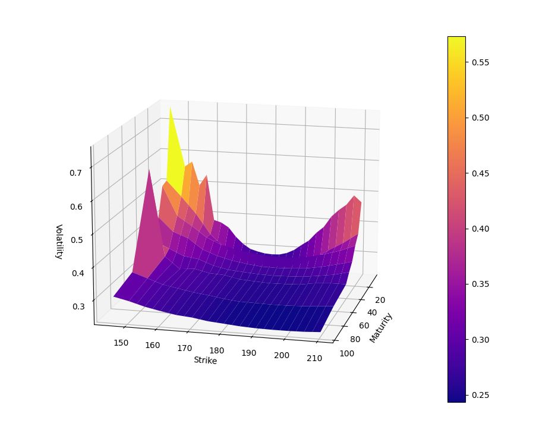
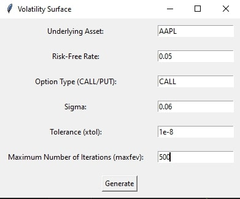

# Volatility Surface Generator

This Python script generates a volatility surface for a given underlying asset using option prices retrieved from Yahoo Finance. It employs the Black-Scholes-Merton (BSM) model for implied volatility calculation.

## Requirements

- Python 3.x
- yfinance
- pandas
- numpy
- scipy
- matplotlib
- tkinter

## Installation

1. Clone the repository:

    ```bash
    git clone https://github.com/votre_utilisateur/nom_depot.git
    ```

2. Install the required dependencies:

    ```bash
    pip install -r requirements.txt
    ```

## Usage

1. Run the script:

    ```bash
    python volatility_surface.py
    ```

2. Enter the required parameters in the GUI window:
   - Underlying Asset: Enter the ticker symbol of the underlying asset.
   - Risk-Free Rate: Enter the risk-free rate (decimal).
   - Option Type (CALL/PUT): Enter the type of option to analyze (CALL or PUT).
   - Sigma: Enter the initial guess for volatility (decimal).
   - Tolerance (xtol): Enter the tolerance for the solver.
   - Maximum Number of Iterations (maxfev): Enter the maximum number of iterations for the solver.

3. Click the "Generate" button to generate the volatility surface plot.

## Example



## Note

- The script retrieves historical stock data and option chain data from Yahoo Finance.
- It filters option contracts based on strike price proximity to the current stock price.
- The BSM model is used to calculate implied volatility.
- The GUI is implemented using Tkinter.


